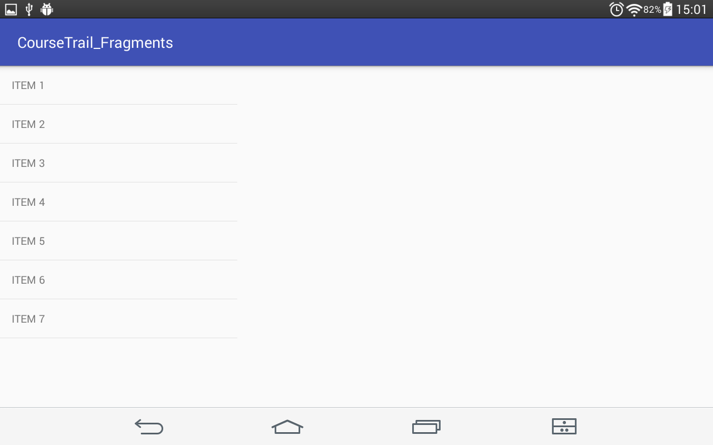
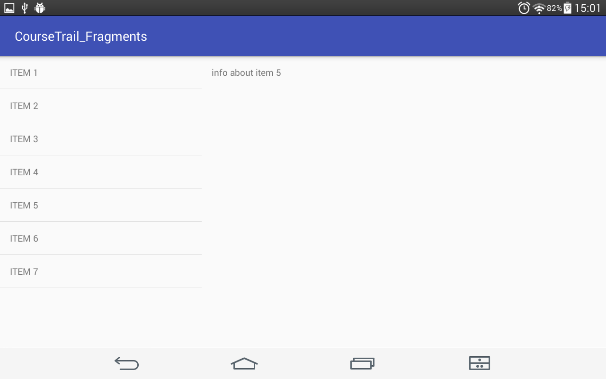
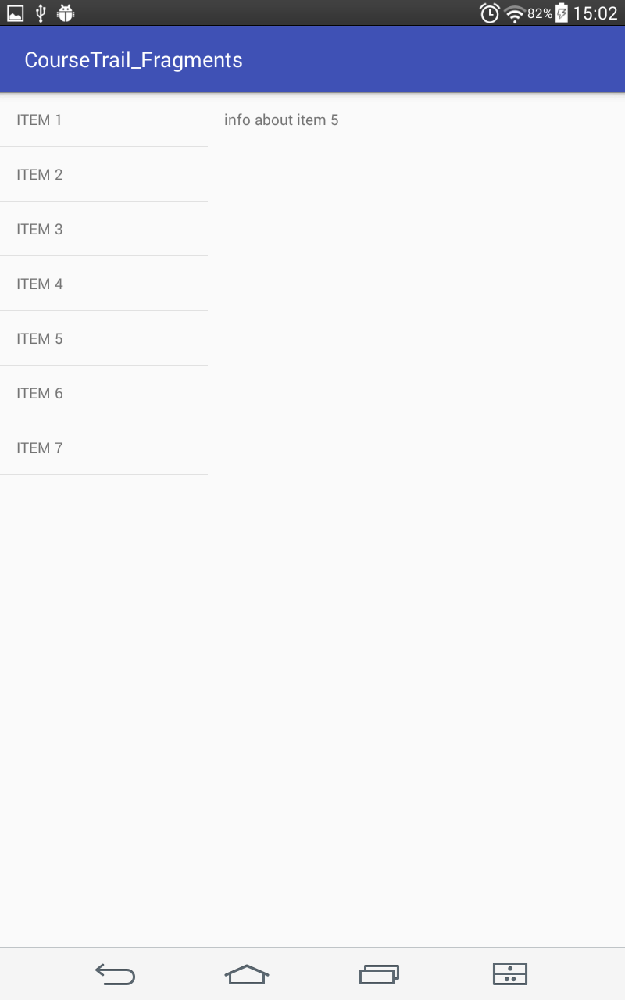
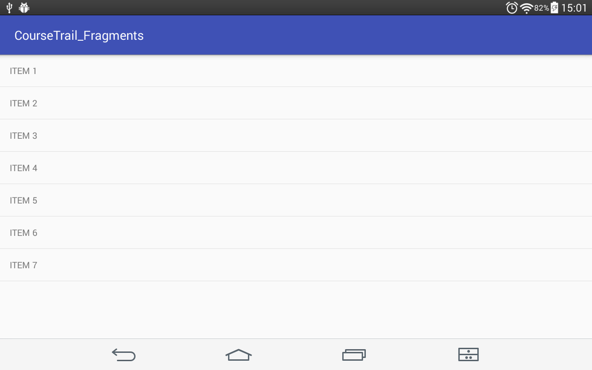
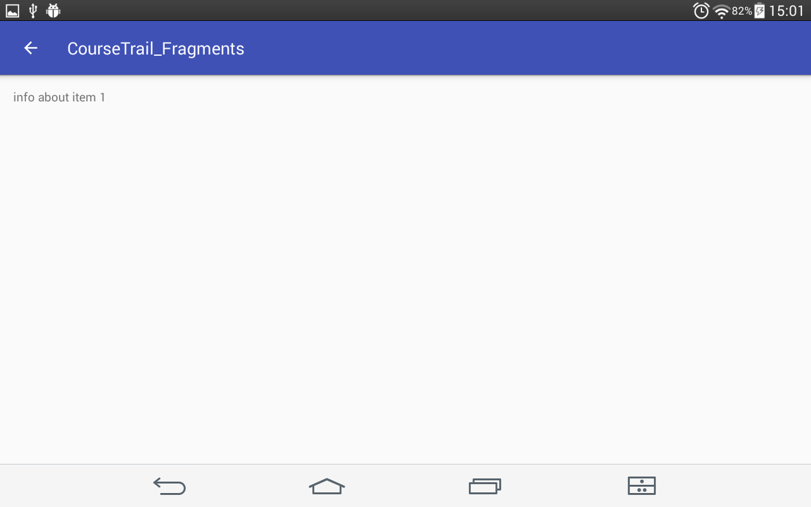

# using Fragments (Master Detail Flow example)

App is very simple. 

On tablets you touch item in master fragment and detail fragment changes to show info about this item. 
This step is saved in stack of fragments history. 
If you press back button app goes one step back in history.
If you turn your screen info in detail fragment is still shown.

On smartphones however when you touch item in master fragment new Activity is opened that shows info about this item.

